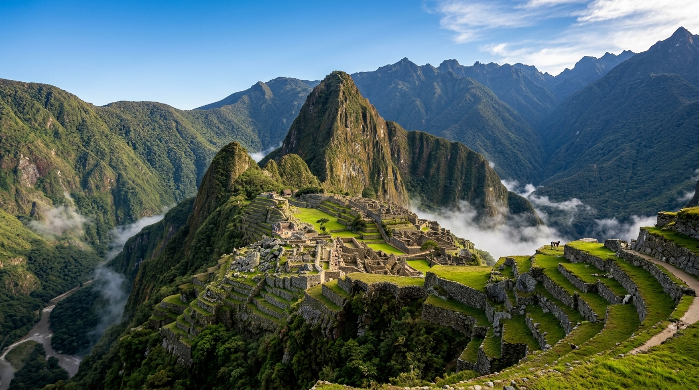

# 🏛️ 世界遺産マスター 1273 - UNESCO World Heritage Quiz & Digital Explorer

実在するUNESCO世界遺産**全1,273件**を完全収録した、テキストベースのWebクイズ＆デジタルインタラクティブ百科事典です。



---

## 🌟 主な特徴

- **🌍 全1,273件の完全データベース搭載**: ユネスコ（UNESCO）に登録されている実在する全世界遺産をカバー。日本語名・英語名・所在国・地域区分・分類・登録年・解説文を網羅しています。
- **✨ 洗練されたテキストベースデザイン**: 写真に依存せず、文化遺産・自然遺産・複合遺産の分類に応じたスタイルや、国旗・地域バッジを用いたスタイリッシュなカードUI。
- **🧠 5つの豊富なクイズモード**:
  1. 📘 **基礎知識・制度クイズ**: 世界遺産条約、ユネスコの仕組み、登録基準、日本の遺産史などを学ぶ。
  2. 🌍 **所在地・国当てクイズ**: 遺産名からそれが位置する国や地域を当てる。
  3. 🏛️ **遺産当て・説明クイズ**: 国名や特徴・解説文から正しい世界遺産名を推理する。
  4. 📅 **登録年クイズ**: 世界遺産に登録された年代（1978年〜現在）を当てる。
  5. ⚡ **スピードラン（全ミックス）**: 1問15秒制限！1,273件＋基礎知識の全ジャンルからランダム出題される高得点モード。
- **🔍 爆速デジタル図鑑（エクスプローラー）**:
  - 1,273件をストレスなく閲覧できる**40件ずつの分割読み込み（ページネーション）**。
  - **遺産種別フィルター**: 文化遺産 / 自然遺産 / 複合遺産
  - **地域区分フィルター**: アジア / ヨーロッパ / 北アメリカ / 南アメリカ / アフリカ / オセアニア
  - **リアルタイム検索**: 遺産名（日本語・英語）、国名、地域名、登録年での高速検索。
- **🔊 サウンド & 演出エフェクト**: 効果音（正解・不正解・クリック音）、連続正解コンボ、紙吹雪演出（Confetti）、アチーブメント（実績）解放システム。

---

## 🛠️ 技術スタック

- **Core**: HTML5, JavaScript (ES Modules)
- **Build Tool**: [Vite](https://vitejs.dev/) v8
- **Styling**: Vanilla CSS (CSS Variables, Flexbox/Grid, Modern Typography)
- **Effects**: `canvas-confetti`
- **Data Source**: Wikidata SPARQL API & UNESCO World Heritage Open Dataset

---

## 🚀 クイックスタート

### 動作要件
- Node.js 18.0 以上

### インストールと開発サーバー起動

```bash
# 依存パッケージのインストール
npm install

# 開発サーバーの起動 (Vite)
npm run dev
```

ローカルブラウザで `http://localhost:5173`（または表示されたURL）にアクセスします。

---

## 📦 プロダクションビルド

本番用アセットの出力およびプレビュー：

```bash
# プロダクションビルドの実行
npm run build

# ビルド成果物のローカルプレビュー
npm run preview
```

> **Note**: 本アプリはデータ容量の最適化のために **Vite Code-Splitting** を導入しており、アプリ本体 (`index.js`) と 1273件のデータベース (`world-heritage-data.js`) が自動分割されて高速に配信されます。

---

## 📂 プロジェクト構造

```
world-heritage-quiz/
├── public/
│   ├── favicon.svg
│   └── images/
│       └── hero_banner.jpg        # タイトル・ヒーローエリア用メインビジュアル
├── scripts/
│   ├── fetch_all_sites.js         # Wikidata/UNESCOから全遺産データを生成するスクリプト
│   └── clean_dataset.js           # 1273件データセットの抽出・クレンジングスクリプト
├── src/
│   ├── data/
│   │   ├── sites.js               # データアクセス・基礎知識問題・実績定義
│   │   └── world_heritage_sites.json # 1273件の世界遺産マスターデータ
│   ├── app.js                     # メインアプリケーション制御 & ビュー遷移
│   ├── audio.js                   # Web Audio API ベースの効果音モジュール
│   ├── explorer.js                # デジタル図鑑（検索・フィルター・分割表示）
│   ├── quiz.js                    # 動的クイズ生成エンジン
│   └── style.css                  # デザインシステム & コンポーネントCSS
├── index.html                     # アプリケーションのエントリーポイント
├── package.json
└── vite.config.js                 # Vite ビルドおよびコード分割設定
```

---

## 📄 ライセンス

このプロジェクトは MIT ライセンスのもとで公開されています。
データは UNESCO World Heritage List および Wikidata オープンデータに基づいています。
